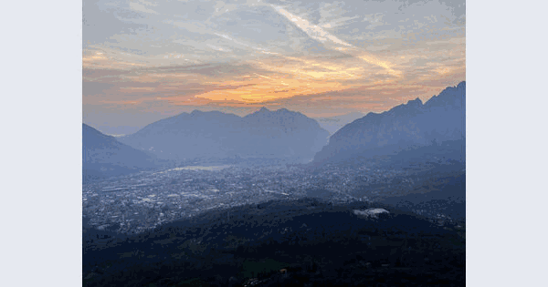
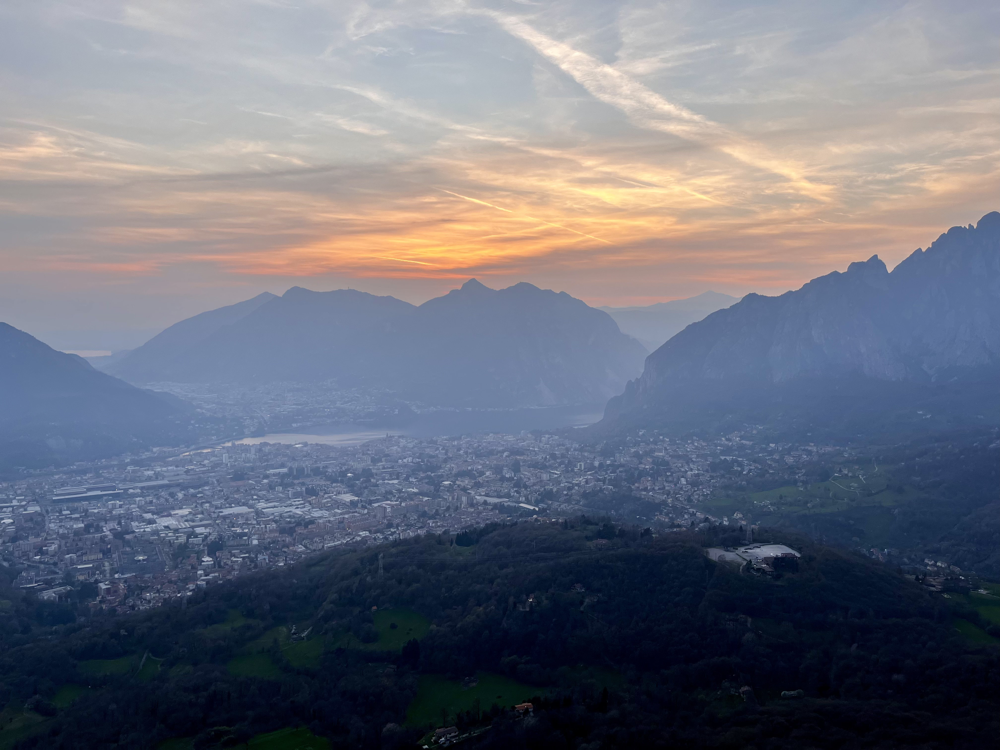
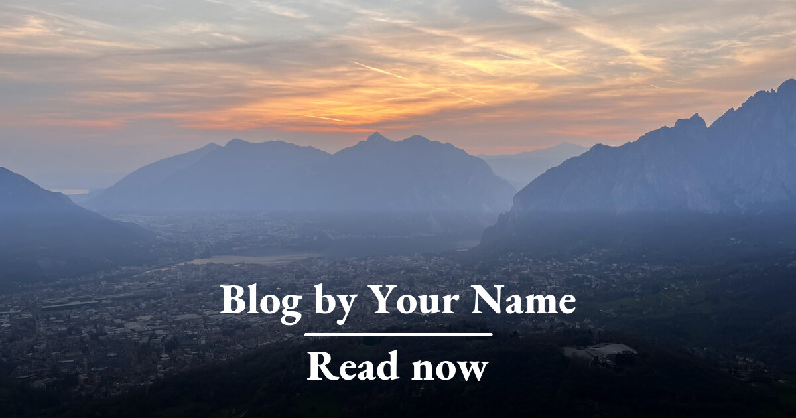
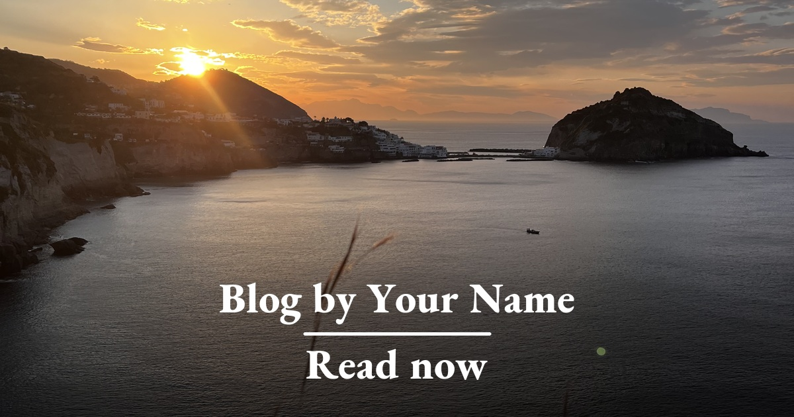

# social_preview

Two shell scripts that turn one of your photos into a clean **1200×630 social
preview image** (Open Graph / Twitter card) using ImageMagick.

- **`og-simple.sh`** — the photo, a dark gradient at the bottom, two lines of
  centered text. Quick, calm, content-first.
- **`og-advanced.sh`** — the photo in a framed card with a soft shadow and a
  few accent shapes, paired with a title block and a call-to-action button.
  Auto-adapts to both portrait and landscape photos.
- **`og-batch.sh`** — run either script over every image in a folder.



---

## Examples

Both inputs live in [`assets/`](assets/). Outputs are in
[`assets/examples/`](assets/examples/).

|              | Landscape input                              | Portrait input                              |
| ------------ | -------------------------------------------- | ------------------------------------------- |
| **Raw**      |                          |                         |
| **Simple**   |          |         |
| **Advanced** |        |       |

---

## Requirements

- **ImageMagick 7** (the `magick` command).
  - macOS: `brew install imagemagick`
  - Debian/Ubuntu: `sudo apt install imagemagick`
  - Windows: `winget install ImageMagick.ImageMagick` (or `choco install
    imagemagick`). Run the scripts from Git Bash / WSL.
- A **font file (.ttf)** you have installed locally. The scripts default to
  fonts in `~/Library/Fonts/` (macOS). Edit the `FONT…` variables at the top
  of each script to point at any `.ttf` you have.
  - Free starter fonts: [Poppins](https://fonts.google.com/specimen/Poppins),
    [EB Garamond](https://fonts.google.com/specimen/EB+Garamond),
    [Inter](https://fonts.google.com/specimen/Inter).

---

## Quick start

```bash
chmod +x og-simple.sh og-advanced.sh og-batch.sh

# one image, simple style
./og-simple.sh assets/wide.jpg out.jpg

# one image, fancy style
./og-advanced.sh assets/wide.jpg out.jpg

# every image in a folder (defaults to the simple style)
./og-batch.sh ~/photos ~/photos/og

# every image in a folder, advanced style
./og-batch.sh ~/photos ~/photos/og ./og-advanced.sh
```

---

## Customizing

Open the script you want to use and edit the **CONFIG** block at the top.
Everything you'll usually want to change is there.

### `og-simple.sh`

```bash
TITLE="Blog by Your Name"
SUBTITLE="Read now"
FONT="${HOME}/Library/Fonts/EBGaramond-ExtraBold.ttf"
TEXT_COLOR="white"
GRADIENT_OPACITY=0.7    # 0 = invisible, 1 = solid black bottom half
```

### `og-advanced.sh`

```bash
SUBTITLE="Blog by"
TITLE="Your Name"
BTN_TEXT="Read now"

FONT_TITLE="${HOME}/Library/Fonts/Poppins-ExtraBold.ttf"
FONT_SUB="${HOME}/Library/Fonts/Poppins-SemiBold.ttf"
FONT_BTN="${HOME}/Library/Fonts/Poppins-SemiBold.ttf"

BG_TOP='#f6f7f9'        # background gradient top
BG_BOT='#e6e9f0'        # background gradient bottom

S1='#FF6B6B'            # coral  — rounded rect, top-left of photo
S2='#5B8DEF'            # blue   — rounded rect, bottom-right of photo
S3='#FFC93C'            # yellow — circle, top-right of photo

TITLE_COL='#111111'
SUB_COL='#6b7280'
BTN_COL='#111111'
BTN_TEXT_COL='white'
```

### German example (the original author's config)

```bash
SUBTITLE="Blog von"
TITLE="Max Stridde"
BTN_TEXT="Jetzt lesen"
```

### Picking colors

The advanced layout looks best when **S1 / S2 / S3 share a vibe** (all muted,
all saturated, all pastel) and **contrast clearly with `BG_TOP`/`BG_BOT`**.
A safe starting point is two complementary hues plus one neutral accent.

Want help picking a palette that matches your site? Copy
[`PROMPT.md`](PROMPT.md) into ChatGPT/Claude — it's a ready-made prompt that
returns drop-in `S1/S2/S3/BG_*` values for `og-advanced.sh`.

---

## How the scripts work

### Simple

1. Resize and crop the input to exactly **1200×630**, centered.
2. Paint a black-to-transparent gradient over the bottom half so light text
   stays readable on any photo.
3. Draw the two text lines and a small underline in the lower-middle.

### Advanced

1. **Normalize EXIF orientation** so phone photos never come out sideways.
2. **Pick a photo box** that matches the input's shape — landscape inputs get
   a wide box (540×384), portrait inputs get a tall one (384×520). Everything
   downstream is positioned relative to this box, so the layout never breaks
   when you swap orientations.
3. Crop the photo into the box, **round its corners**, drop it inside a white
   frame, and lay a **soft blurred shadow** beneath it.
4. Place three **accent shapes** (rect, rect, circle) so they peek out from
   behind the frame — coral top-left, yellow top-right, blue bottom-right.
5. Draw the **subtitle / title** to the right of the photo and a **pill
   button** beneath them.
6. Add a thin **multi-color line** across the very top of the canvas.

---

## Automating it

- **In CI:** `og-batch.sh` is a single bash call, so it drops cleanly into a
  GitHub Action (or any CI runner that has ImageMagick) — e.g. regenerate
  previews whenever a new photo lands in your content folder, and commit the
  results back. No workflow is included here on purpose; the right trigger
  depends on how your site is built.
- **In an LLM-driven setup:** because the per-image config lives in plain
  `KEY="value"` lines at the top of each script, an LLM can generate a
  per-post variant for you (e.g. rewriting `TITLE` / `SUBTITLE` / colors from
  a Markdown frontmatter block) before invoking the script. Pair it with
  [`PROMPT.md`](PROMPT.md) for the palette and you have a fully automated
  preview pipeline.

---

## Why 1200×630?

It's the size Open Graph, Twitter/X, LinkedIn, and most chat apps render at
the largest. Going smaller gets upscaled and looks fuzzy; going larger gets
downscaled and wastes bandwidth.

To use the result, save it next to your site and add to the page's `<head>`:

```html
<meta property="og:image" content="https://example.com/og.jpg" />
<meta property="og:image:width" content="1200" />
<meta property="og:image:height" content="630" />
<meta name="twitter:card" content="summary_large_image" />
```

---

## License

[MIT](LICENSE) — do whatever you want, no warranty.
